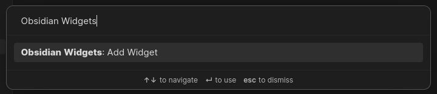

# Obsidian Widgets

Adds cool widgets within Obsidian notes

## Usage

To insert a widget, simply add a code block with the language `widgets` and add your options to the body

````
```widgets
<OPTIONS>
```
````

Currently, the available widgets are:

## Clock


#### Configuration Body

`type`: clock

#### Example

````
```widgets
type: clock
```
````

## Quote


#### Configuration Body:

`type`: quote

`quote`: the quote you want to display

`author`: the author of the quote (optional)

#### Example

````
```widgets
type: quote
quote: Lorem ipsum dolor sit amet
author: Lorem Ipsum
```
````

## Countdown


#### Configuration Body:

`type`: countdown

`date`: Must be in the format `YYYY-MM-DD HH:MM:SS`

`to`: Description of the countdown (optional)

#### Example

````
```widgets
type: countdown
date: 2024-01-01 00:00:00
to: New Year! 🎉
```
````

## Command Pallete

Obsidian Widgets also comes with a handy command on the command pallete (Ctrl+P) to add widgets on the fly



## Suggestions

-   [Widget requests, bugs, new feature requests](https://github.com/rafaelveiga/obsidian-widgets/issues)

## Support

If you find this plugin useful and would like to support its development, you can sponsor me on Ko-Fi

[](https://ko-fi.com/Z8Z0SNIS3)
