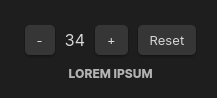
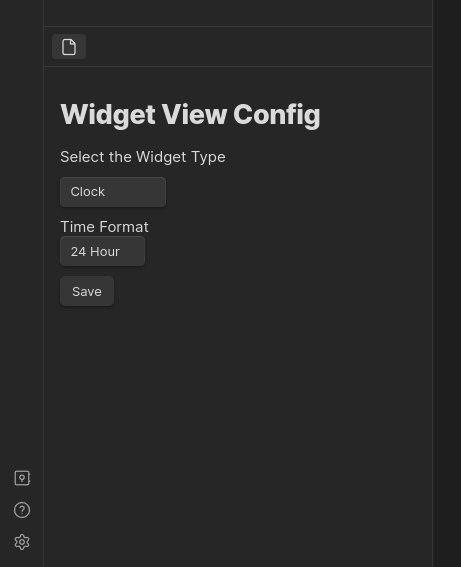

# Obsidian Widgets

Adds cool widgets within Obsidian notes

## Usage

To insert a widget, simply add a code block with the language `widgets` and add your options to the body

````
```widgets
<OPTIONS>
```
````

Currently, the available widgets are:

## Clock


#### Configuration Body

`type`: clock

`format`: the time format you want to display on the clock. Supports "12hr", "24hr"

`hideSeconds`: if you want to display seconds or not. Supports "false" or "true". If ommited, will display seconds (optional)

#### Example

````
```widgets
type: clock
format: "12hr" | "24hr"
```
````

## Quote


#### Configuration Body:

`type`: quote

`quote`: the quote you want to display

`author`: the author of the quote (optional)

#### Example

````
```widgets
type: quote
quote: Lorem ipsum dolor sit amet
author: Lorem Ipsum
```
````

## Countdown


#### Configuration Body:

`type`: countdown

`date`: Accepts either the standard format `YYYY-MM-DD HH:MM:SS` or relative time expressions such as `+Ns` (seconds), `+Nm` (minutes), `+Nh` (hours), and `+Nd` (days), where `N` is a numerical value.

`to`: Description of the countdown (optional)

`completedLabel`: The label to show when the countdown is complete (optional)

#### Example

````
```widgets
type: countdown
date: 2024-01-01 00:00:00
to: New Year! 🎉
completedLabel: Happy new year! 🎉
```
````

## Counter



#### Configuration Body:

`type`: counter

`text`: the text label below the counter

`id`: the id of the counter. Use this if you want to have more than one counter in the same note (optional)

#### Notice

The counter widget is supported multiple times by note if you provide an unique `id` per counter. If you add more than one counter widget to a note without an `id`, they will share the same count. To sync the count between devices, make sure your `.obsidian/plugins` folder is synced between devices. This is where Obsidian stores the data for this plugin

#### Example

````
```widgets
type: counter
text: Push-ups
id: push-ups
```
````

## Customizing your widgets

We currently do not support and don't plan to support customizing styles and colors of each widget via options in the widgets code block. Each widget is set to respect your theme's colors. That does not mean you can further customize the look of your widgets to your liking via CSS Snippets.

If you want to customize your widgets, please follow the [guide](STYLING.md)

## Widget View

Obsidian Widgets comes with a command to add a Widget as a view to your workspace. This is useful if you want to have a widget always visible on your workspace. To use the command, open the Command Pallete (Ctrl + P) and select "Open widget view"



## Command Pallete

Obsidian Widgets also comes with a handy command on the command pallete (Ctrl+P) to add widgets on the fly


## Suggestions

-   [Widget requests, bugs, new feature requests](https://github.com/rafaelveiga/obsidian-widgets/issues)

## Support

If you find this plugin useful and would like to support its development, you can sponsor me on Ko-Fi

[](https://ko-fi.com/Z8Z0SNIS3)
